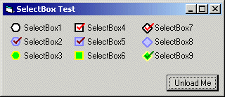



## Owner\-Drawn Transparent SelectBox

### Description

Building on my previous transparent bullet labels submission, I have built this control which draws transparent checkboxes. It is still a work in progress but ready for feedback. One drawback, it uses the dreaded GetKeyState + Timer combination to capture mouse clicks within the control rectangle. If anyone knows a better way to trap mouse events on the transparent parts of a control, I'd be happy to hear it...Anyway, it is functional...just launch the .vbg file...
 
### More Info
 

             |
---                |---
**Submitted On**   |2004-10-01 18:19:02
**By**             |[AlT](https://github.com/Planet-Source-Code/PSCIndex/blob/master/ByAuthor/alt.md)
**Level**          |Intermediate
**User Rating**    |5.0 (20 globes from 4 users)
**Compatibility**  |VB 6\.0
**Category**       |[Custom Controls/ Forms/  Menus](https://github.com/Planet-Source-Code/PSCIndex/blob/master/ByCategory/custom-controls-forms-menus__1-4.md)
**World**          |[Visual Basic](https://github.com/Planet-Source-Code/PSCIndex/blob/master/ByWorld/visual-basic.md)
**Archive File**   |[Owner\-Draw1799521012004\.zip](https://github.com/Planet-Source-Code/alt-owner-drawn-transparent-selectbox__1-56459/archive/master.zip)

### API Declarations

A few.... ;-)

